# Astral HV-NGFW – Reference and Updates Document
**Living Document – Version 1.1**
**Last updated:** December 20, 2025

---

## 📋 ABOUT THIS DOCUMENT

This document serves as the central technical reference and changelog for the **Astral HV-NGFW** project. Instead of publishing multiple papers during development, we maintain this single, versioned document to:

- Preserve a historical record of architectural decisions
- Document progress between significant commits
- Serve as a reference for contributors and stakeholders
- Avoid fragmentation of technical documentation

> ⚠️ **IMPORTANT NOTICE**: This is a living development document. All ideas, specifications, and decisions are subject to change without notice. The architecture may evolve as development progresses.

### Conventions:
- ✅ = Implemented and tested
- 🔄 = In development
- 📋 = Planned / Backlog
- ❌ = Cancelled / Replaced

---

## 📅 UPDATE TIMELINE

### **DECEMBER 18, 2025 – Version 0.1**
**Critical Change**: Replacement of SQL Server with **PostgreSQL**
- **Reason**: Full alignment with open-source philosophy and GPLv3
- **Impact**: Elimination of licensing costs, improved portability
- **Target System**: **Fedora 43 (official release, 2025)**

### **DECEMBER 20, 2025 – Version 1.0**
- Creation of the central reference document
- Consolidation of full architecture and philosophy
- Establishment of the official roadmap
- Definition of the **4 non-negotiable principles**

---

## 🎯 FUNDAMENTAL PRINCIPLES (IMMUTABLE)

### 1. **Determinism over Magic**
✅ **Status**: Principle established
📝 **Implementation**: All code follows the **intent → validation → execution → audit** pattern.

### 2. **Auditability over Convenience**
✅ **Status**: Principle established
📝 **Implementation**: Structured logs stored in PostgreSQL; no "silent" operations.

### 3. **Fallback over Dependency**
✅ **Status**: Principle established
📝 **Implementation**: Every optional component has a clean removal path.

### 4. **Human Authority over Automation**
✅ **Status**: Principle established
📝 **Implementation**: No unauthorized auto-remediation is permitted.

---

## 🏗️ IMPLEMENTATION STATUS BY LAYER

```mermaid
flowchart TB
    subgraph L_APP [Application & Orchestration]
        direction TB
        L1["Layer 1: UI & Orchestration<br/>(Spring Boot + Tailwind)<br/>🔄 In Dev (15%)"]
        L2["Layer 2: Core Python Service<br/>(Structure Defined)<br/>🔄 In Dev (10%)"]
        L3["Layer 3: PostgreSQL Database<br/>(Schema & Extensions)<br/>✅ Updated (20%)"]
    end

    subgraph L_NET [Network & Security]
        direction TB
        L4["Layer 4: Network (NM)<br/>✅ POC Implemented"]
        L5["Layer 5: Firewall (nftables)<br/>✅ POC Implemented"]
        L6["Layer 6: Identity (Samba AD)<br/>✅ POC Implemented"]
        L7["Layer 7: Hybrid DNS<br/>✅ POC Implemented"]
    end

    subgraph L_INFRA [Infrastructure & Ops]
        direction TB
        L8["Layer 8: Hypervisor (KVM)<br/>📋 Planned (0%)"]
        L9["Layer 9: Citrix CVAD<br/>📋 Defined (Config Only)"]
        L10["Layer 10: Package System<br/>📋 In Design (2%)"]
        L11["Layer 11: Observability<br/>📋 In Design (3%)"]
    end

    %% Styling
    classDef implemented fill:#d4edda,stroke:#155724,stroke-width:2px;
    classDef inprogress fill:#fff3cd,stroke:#856404,stroke-width:2px;
    classDef planned fill:#e2e3e5,stroke:#383d41,stroke-width:1px;

    class L3,L4,L5,L6,L7 implemented;
    class L1,L2 inprogress;
    class L8,L9,L10,L11 planned;
```



---

## 🔄 DYNAMIC ROADMAP


> *(Roadmap will be updated continuously as work progresses)*

---

## 🐛 ARCHITECTURAL DECISION LOG


---

## 📊 UPDATED TECHNICAL SPECIFICATIONS

### **Official Development Environment**
- **OS**: Fedora 43 Workstation / Server
- **Architecture**: x86_64
- **Minimum RAM**: 4 GB
- **Storage**: 25 GB minimum

### **Technology Stack**
```text
Core Backend: Python 3.12+
  - Modules: psycopg2, sqlalchemy, flask (internal APIs)
  - Framework: Custom (no Django/Flask for core)

UI/Orchestration: Spring Boot 3.2+
  - Template Engine: Thymeleaf
  - CSS Framework: Tailwind CSS
  - Authentication: Spring Security + Samba AD

Database: PostgreSQL 18+
  - Extensions: timescaledb, pg_stat_statements, pgcrypto
  - Connection Pooling: HikariCP (Spring) / psycopg2.pool (Python)

System Integration:
  - Network: NetworkManager (nmcli/dbus via Python)
  - Firewall: iptables/nftables (Python wrapper)
  - Virtualization: KVM/libvirt (Python bindings)
  - Identity: Samba 4.20+ (AD Domain Controller)
```

---

## 🖼️ HIGH-LEVEL ARCHITECTURE


---

## ⚠️ KNOWN LIMITATIONS AND RESTRICTIONS

### **Current Restrictions**
- ❌ **No Docker support**: Native installation only (Fedora/RHEL)
- ❌ **No Citrix VDI included**: Only config compatibility if user provides Citrix
- ⚠️ **Minimum 4 GB RAM** required for basic operation
- 🔧 **Nested virtualization required** for development environments

---

## 🤝 COLLABORATION MODEL

### **For Developers**
- Fork the repository (when public)
- Consult this document for architectural context
- Adhere to the four fundamental principles

### **For Testers / Users**
- Report issues with clear use-case scenarios
- Provide UX feedback

---

## 🏷️ DOCUMENT VERSION HISTORY


---

## 🚨 FINAL WARNING

This is a **living development document**.

All specifications, architecture, and documented decisions are **subject to change without notice**. This document reflects the current state of thinking and development for the **Astral HV-NGFW** project, but **does not constitute a final commitment** to any specific implementation.
